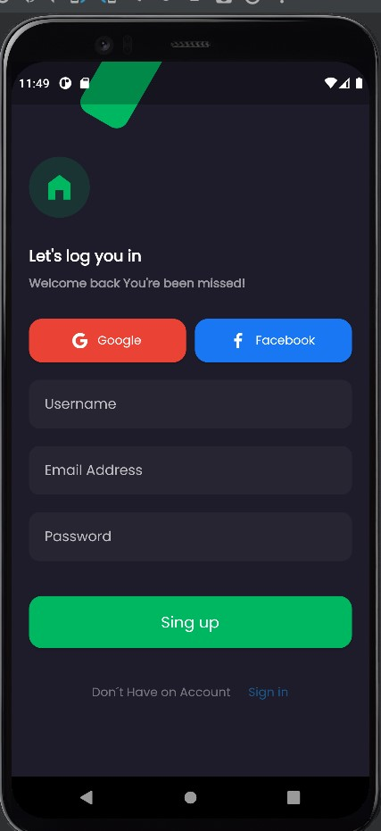
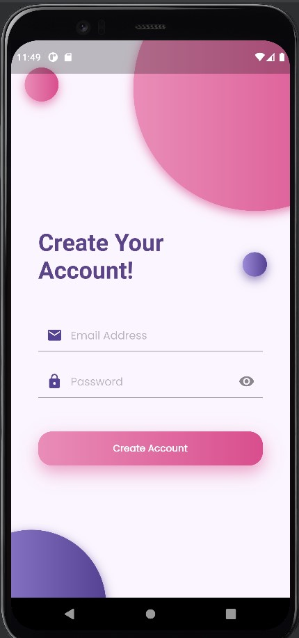
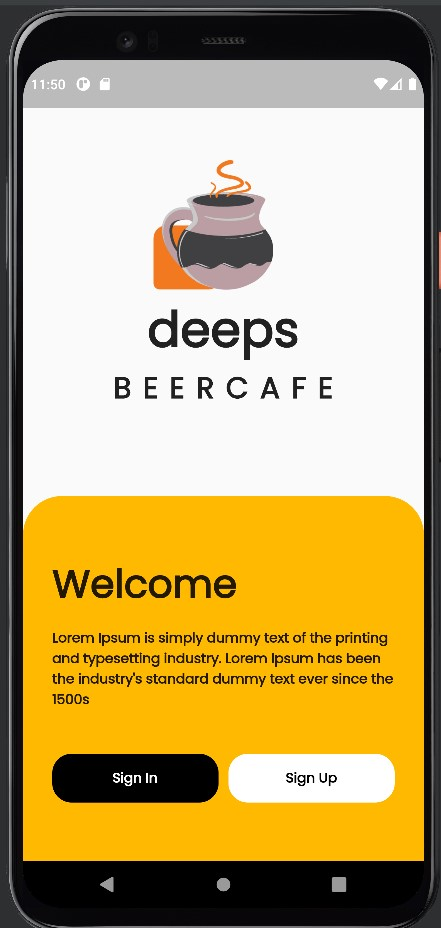
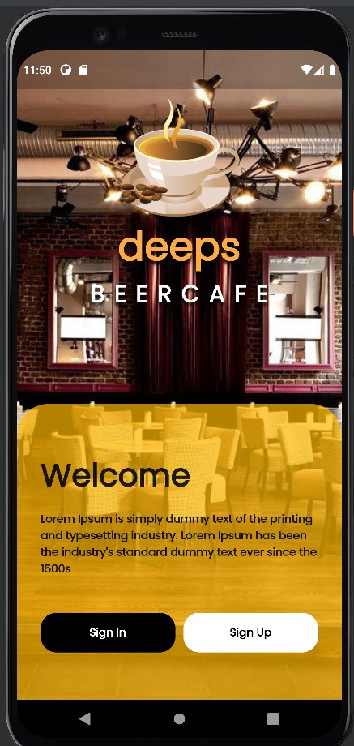
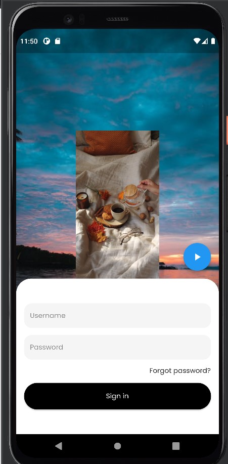
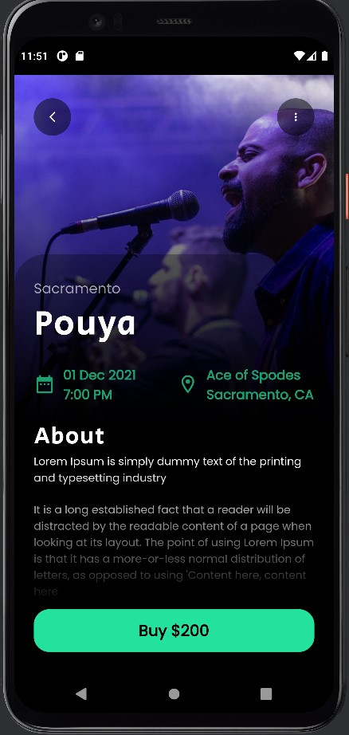

# PROGRAMACIÓN CON FLUTTER
## RETOS CON FLUTTER

- Retos UI
>   # RETO 01 Login 1
>   
>   # RETO 02 Login 2
>   
>   # RETO 03 Login 3
>   
>   # RETO 04 Login 4
>   
>   # RETO 05 Login 5
>   
>   # RETO 06 Publish
>   